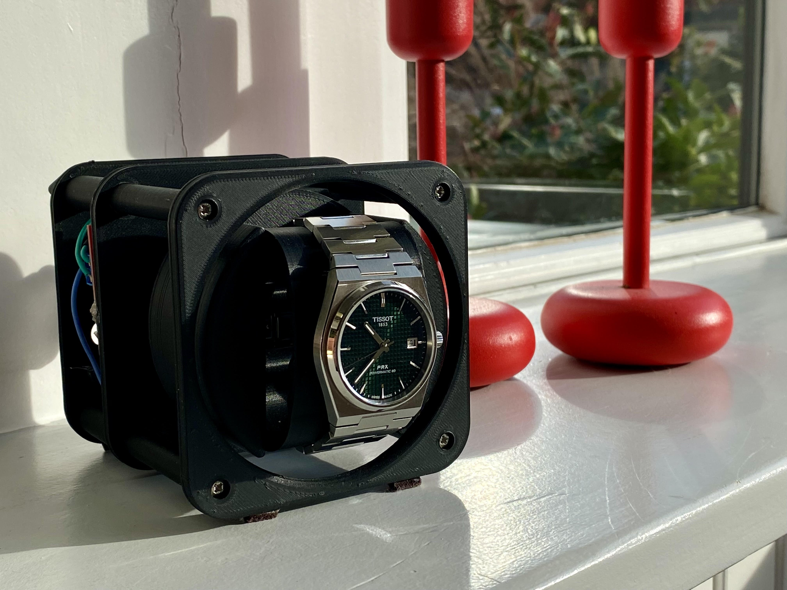

  
  <h2>
    OSWW
    
<i>The Open Source Watch Winder</i>

  </h2>

  <a href="https://www.youtube.com/watch?v=BJKpY6Zp8BI" target="_blank"><strong>👉 See OSWW & Winderoo in action on youtube 👈</strong></a>
   
   
  
   
  

    OSWW is an open source high quality, modular watch winder.
  

### Key Features
* Silent belt drive
* Minimal electronics / programming experience required
* Easy to print!

## Prerequisites

### Download and install the following:
1. [Arduino IDE](https://www.arduino.cc/en/software)
1. [Add Raspberry Pi Pico to the Arduino IDE](https://www.upesy.com/blogs/tutorials/install-raspberry-pi-pico-on-arduino-ide-software)
   - Do not proceed past the heading "**Upload a program to the Pi Pico**"

## Build Instructions
1. [Bill of Materials (what you need to buy)](./instructions/bom-requirements.md)
1. [Printing Recommendations](./instructions/printing-recommendations.md)
   - [Model Files](./models)
1. [Build Guide](./instructions/build-guide.md)
1. [Wiring Diagram](./instructions/wiring-diagram.md)
1. [Upload the Code](./instructions/upload-code.md)

## Supercharge your OSWW!
> This upgrade requires a different microcontroller
- Checkout [Winderoo](https://github.com/mwood77/winderoo), which adds more complex behaviour and a GUI to your build!
