> [👈 Back to main page](../README.md)

# Printing Recommendations
> Total time spent printing is 24 hours per winding unit
>
> Total filament used is approximately 300g per winder

* These are general priting recommendations. 
* Remember that you know your printer better than I.

## General Advice
1. The following models will require support:
    * `STRUCT_mid_plate`
    * `watch_mount`
1. The model is designed to be printed with PLA, therefore tolerances are spec'd for that
    * Tolerances are between `0.1 - 0.2mm`
1. Print with 25% infill
    * This will the increase overall rigidity of the model, especially when dealing with the motor's torque.
    * This will also give you a "premium feeling" product.
1. [If your printer has a tendency elephant foot](https://pick3dprinter.com/elephant_foot_3d_printing/), you'll need to file down some of the pieces.
    * For example, the `mounting_dowel`'s outter lip will need to be filed down so the `mounting_dowel_sleeve` can easily slip over it.

## Recommended Printing Orientation and Duration by Model

| Model Name | Quantity To Print | Printing Time Per Unit | Printing Orientation |
| :------------: | :------------: | :----------------------------------: | :--------:| 
| `clutchless_drive_pulley_v2` | 1 | 2 hours | 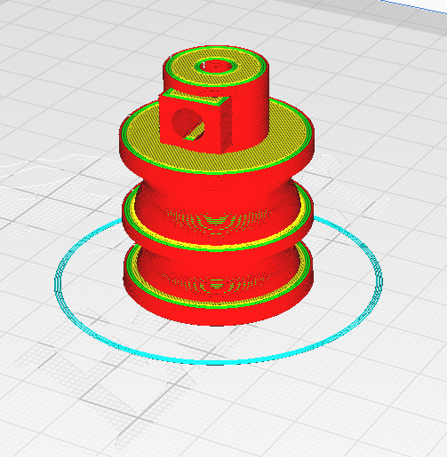 |
| `motor_drive_pulley_v3` | 1 | 0.5 hours | 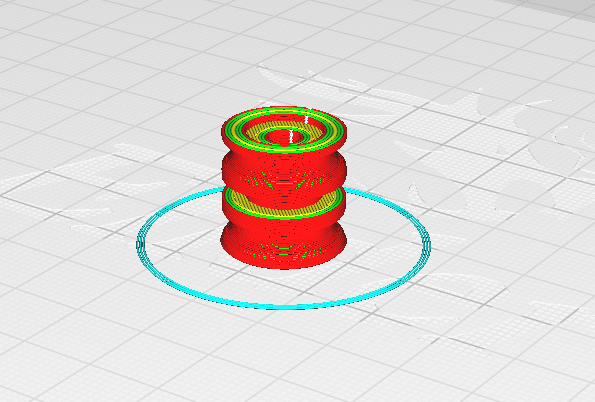 |
| `mounting_dowel_v3` | 4 | 0.75 hours p/unit | 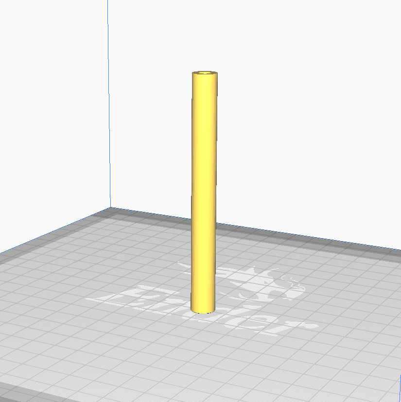 |
| `mounting_dowel_sleeve_v3` | 4 | 0.25 hours p/unit | 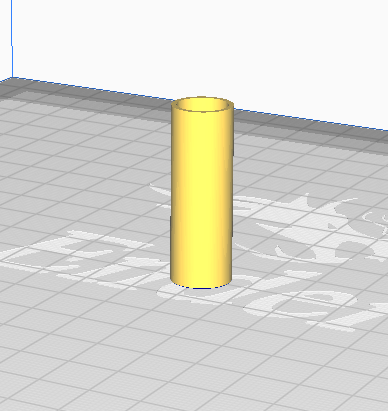 |
| `STRUCT_back_plate_v2` | 1 | 3 hours | 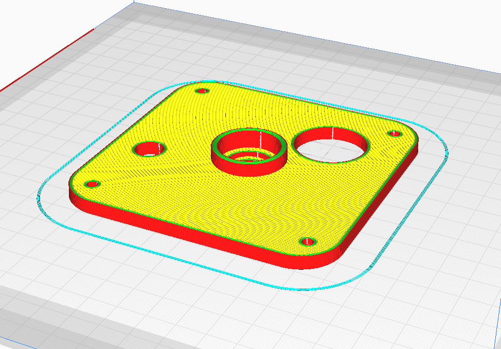 |
| `STRUCT_mid_plate_v2` | 1 | 3 hours | 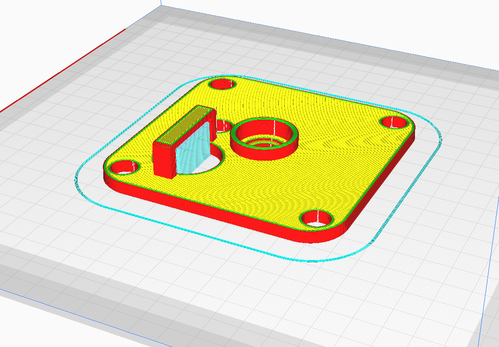 |
| `STRUCT_front_plate_v2` | 1 | 2 hours | 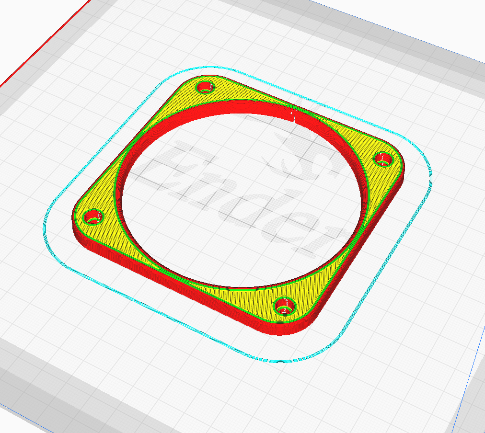 |
| `tensioner_pulley_v1` | 1 | 0.25 hours | 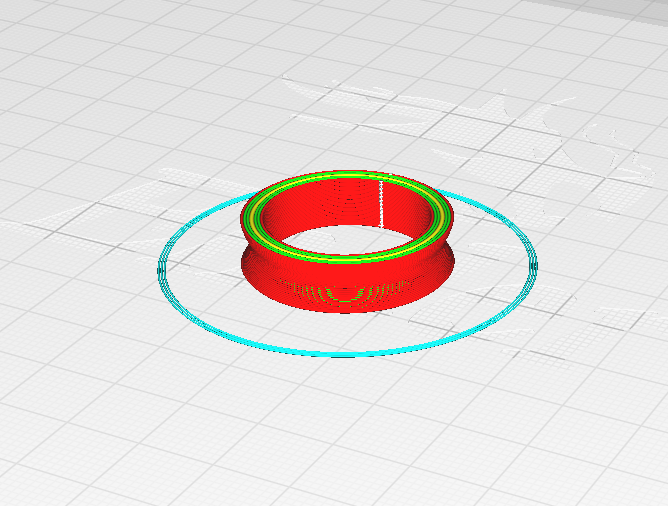 |
| `tensioner_pulley_mount_v2` | 1 | 0.25 hours | 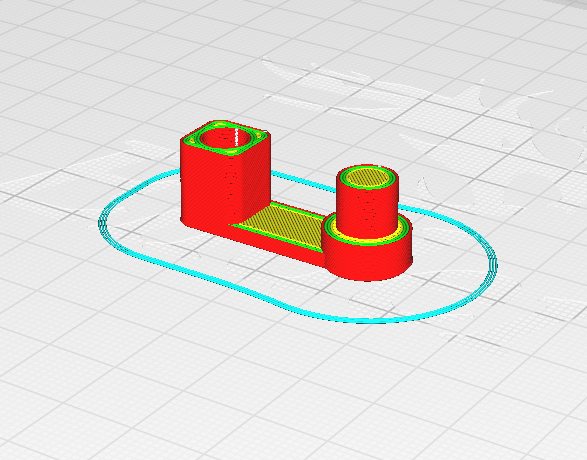 |
| `high_position_tensioner_pulley_mount_v1` | 1 | 0.25 hours | 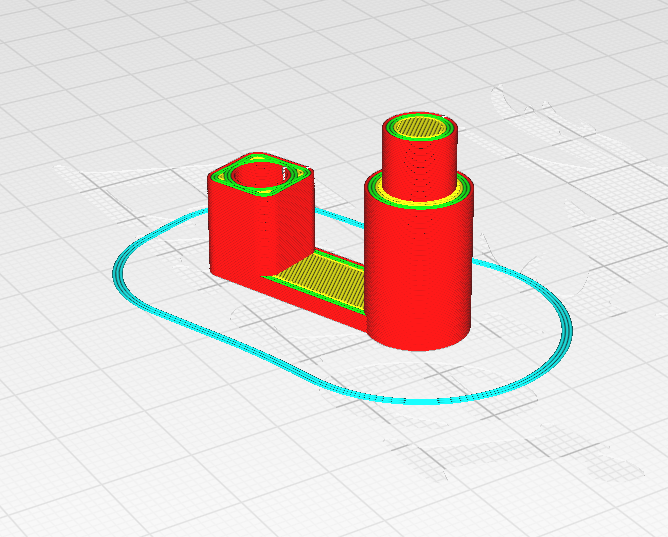 |
| `watch_jig_collar_v4` | 1 | 0.25 hours | 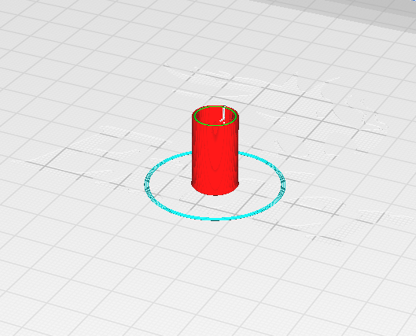 |
| `watch_jig_driveshaft_v3` | 1 | 1 hour | 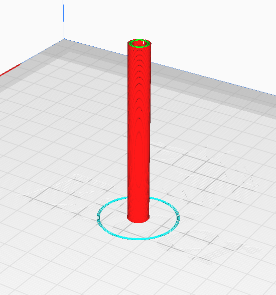 |
| `watch_jig_v4` | 1 | 6 hours | 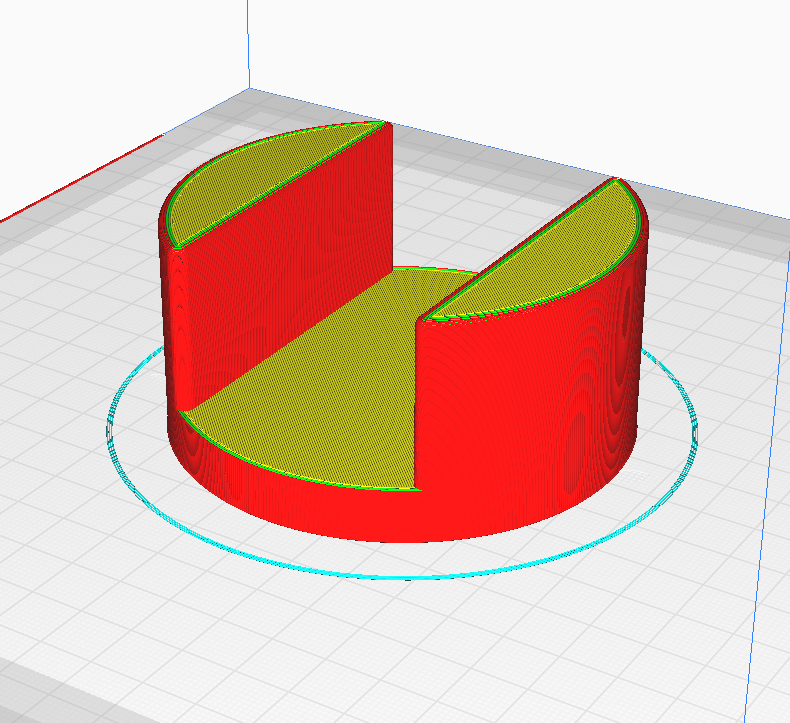 |
| `watch_mount_v7` | 1 | 2 hours | 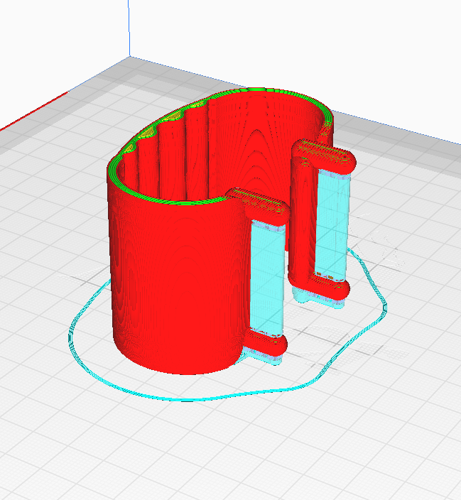 |
| `multi_clip` | 4 | 0.25 hours p/unit | 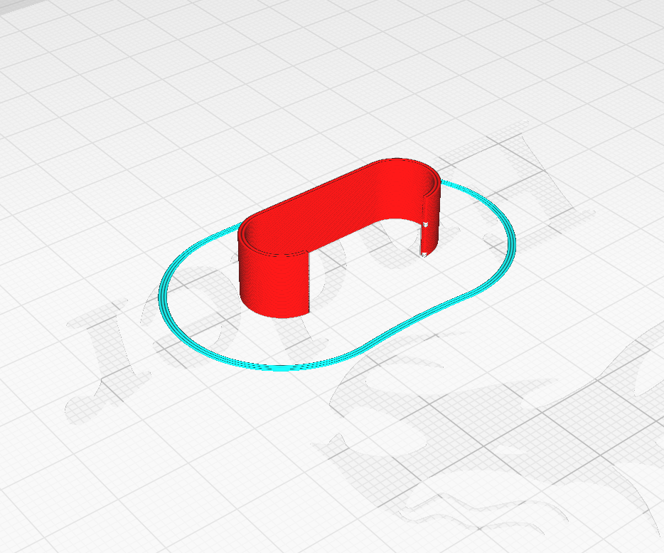 |
| `spring_holder_v3` | 1 | 1 hours | 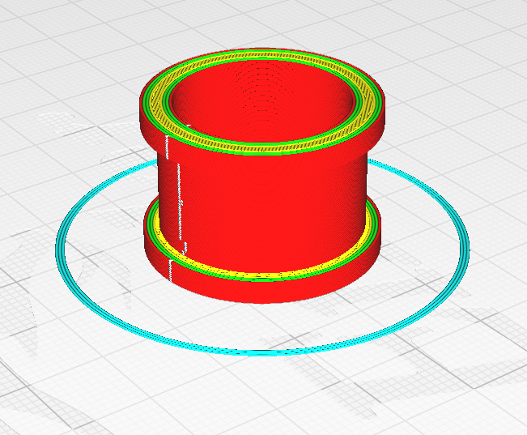 |
| `top_hat_v2` | 4 | 0.25 hours | 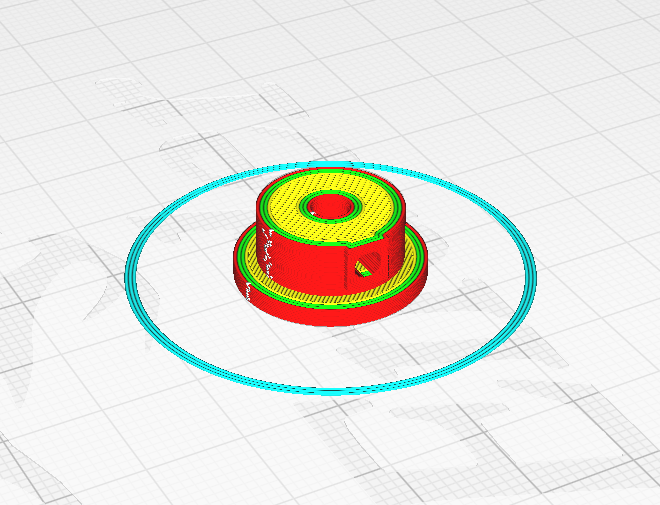 |
