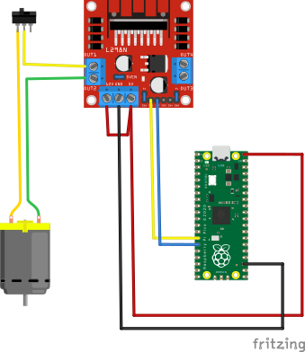

> [👈 Back to main page](../README.md)

# Wiring Diagram - OSWW

    <a href="./images/osww.pdf">Is the image hard to view? Open the PDF instead</a>

 

- Connect the Pi Pico's `VBUS` pin to the 5V input of the L298N driver board (red wire)
- Connect a ground from the Pi Pico the L298N driver board (black wire)
- Connect the L298N driver board's 5V and 12V terminals together (red jumper wire)
- Make sure the L298N's jumpers are in place (small blue wires on board)
- Connect the Pi Pico's `GPIO10` to `IN1` on the L298N driver board (yellow wire)
- Connect the Pi Pico's `GPIO11` to `IN2` on the L298N driver board (blue wire)
- Connect the DC motor to channel 1 on the L298N driver board.
    - > Note: polarity does not matter here
    - You may add a in-line switch between the motor and the L298N driver board; this will enable and disable winding